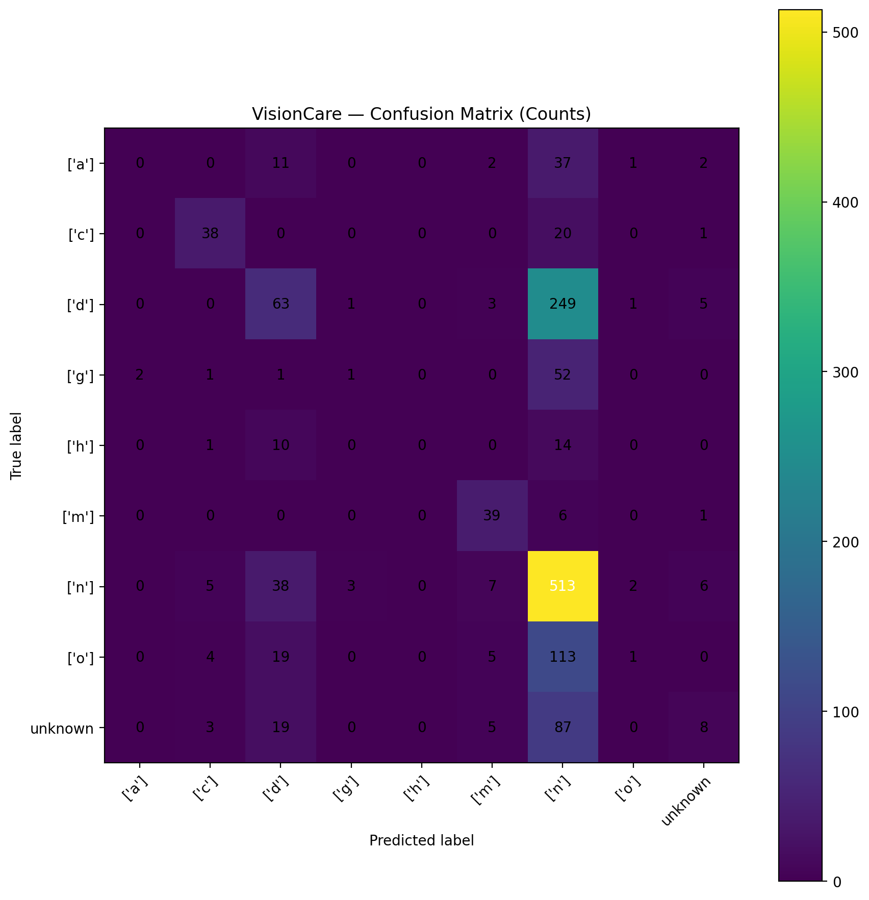

# 👁️ VisionCare: AI for Eye Disease Detection

VisionCare is a machine learning system that analyzes **retinal fundus images** and predicts common eye conditions such as **Diabetic Retinopathy, Glaucoma, and Macular Degeneration**.  
It combines **feature engineering (LBP + color stats)** with classical ML classifiers (SVM baseline), and is extendable to deep learning (CNN / ViT).

---

## 🔑 Features
- **Image Input**
  - Works with `.jpg`, `.png`, `.bmp`, `.tif` images.
  - Supports training (`training images/`) and testing (`testing images/`) folders.

- **Disease Classification**
  - Baseline: SVM classifier with probability scores.
  - Labels are auto-detected from subfolders or mapped via CSV (ODIR style).

- **Artifacts**
  - Feature representations exported as:
    - `visioncare_index.h5`
    - `visioncare_index.pkl`
    - `visioncare_index.yaml`
    - `visioncare_index.json`

- **Visualization**
  - Accuracy curve (5-fold CV).
  - Confusion matrix heatmap.
  - Optional annotated previews with predicted label & confidence.

- **Prediction**
  - Single image → JSON + annotated preview.
  - Batch folder → CSV with predictions + class probabilities.

---

## 📂 Project Structure
Vision Care/
│
├── archive/
│ ├── Odir5k preprocessed with CLAHE/
│ │ ├── training images/ # training set
│ │ └── testing images/ # test set
│
├── visioncare_index.h5 # HDF5 features + labels
├── visioncare_index.pkl # Pickled DataFrame (features + labels)
├── visioncare_index.yaml # Metadata (class map, feature schema)
├── visioncare_index.json # Item-wise index
├── visioncare_accuracy_curve.png
├── visioncare_confusion_matrix_heatmap.png
├── visioncare_cv_scores.csv
├── visioncare_classification_report.txt
├── visioncare_predictions.csv # test predictions
└── visioncare_pred_annotated.png (optional preview)

yaml
Copy code

---

## ⚙️ Setup
Install dependencies in your Jupyter/Colab environment:

```bash
pip install opencv-python-headless scikit-image scikit-learn pandas numpy h5py pyyaml tqdm matplotlib
🚀 Workflow
1. Build Artifacts
Extract features (LBP + color stats) and save as .h5/.pkl/.yaml/.json.

python
Copy code
# Run build_visioncare_artifacts.py (or the provided notebook cell)
Outputs:

visioncare_index.h5

visioncare_index.pkl

visioncare_index.yaml

visioncare_index.json

2. Train + Evaluate
Generate accuracy curve and confusion matrix:

python
Copy code
# Run accuracy + heatmap cell
Outputs:

visioncare_accuracy_curve.png

visioncare_confusion_matrix_heatmap.png

visioncare_cv_scores.csv

visioncare_classification_report.txt

3. Prediction
Single Image

python
Copy code
INPUT_PATH = r"...\training images\some_class\sample.jpg"
res = predict_single(INPUT_PATH, model, class_names)
Saves visioncare_prediction.json + visioncare_pred_annotated.png

Batch Folder

python
Copy code
TEST_DIR = r"...\testing images"
df_preds = predict_folder(TEST_DIR, model, class_names)
Saves visioncare_predictions.csv

📊 Example Output
Single image (fundus_13.png):

json
Copy code
{
  "input": "fundus_13.png",
  "prediction": "Diabetic Retinopathy - Moderate",
  "class_id": 2,
  "confidence": 0.89,
  "all_confidences": {
    "Normal": 0.02,
    "Mild DR": 0.05,
    "Moderate DR": 0.89,
    "Severe DR": 0.04
  }
}
Batch CSV (first few rows):

path	prediction	confidence	prob_Normal	prob_Mild DR	prob_Moderate DR	...
testing/img1.png	Normal	0.91	0.91	0.05	0.02	...
testing/img2.png	Diabetic Retinopathy	0.87	0.07	0.06	0.87	...

🔮 Future Work
Extend to CNN / Vision Transformer models for higher accuracy.

Add Grad-CAM explainability overlays.

Deploy via Streamlit/Gradio dashboard or REST API.

📌 Why This Project
Tackles a real-world healthcare problem.

Shows feature engineering + ML + explainability.

Recruiter-friendly portfolio project.

Easy to demo with any fundus dataset.

yaml
Copy code

---

👉 Do you want me to also prepare a **`requirements.txt`** file so you can install all dependencie
Author
SAGNIK PATRA
